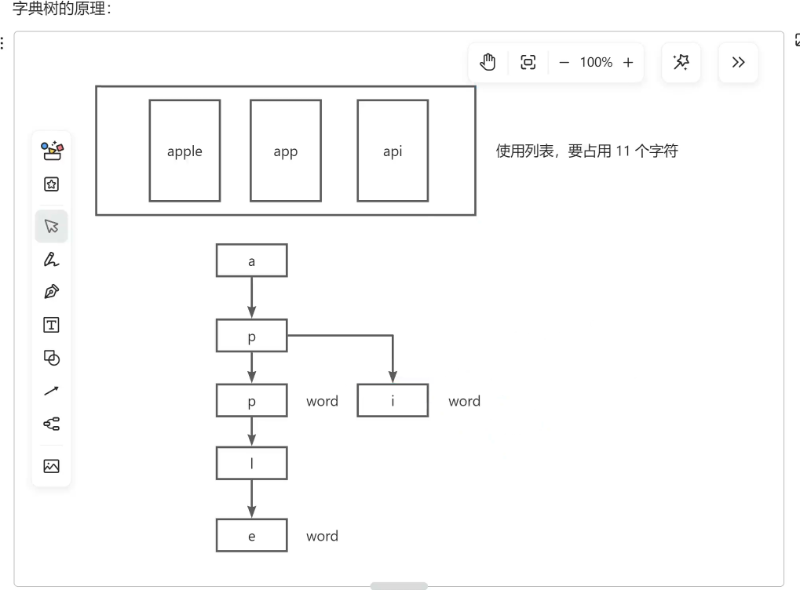
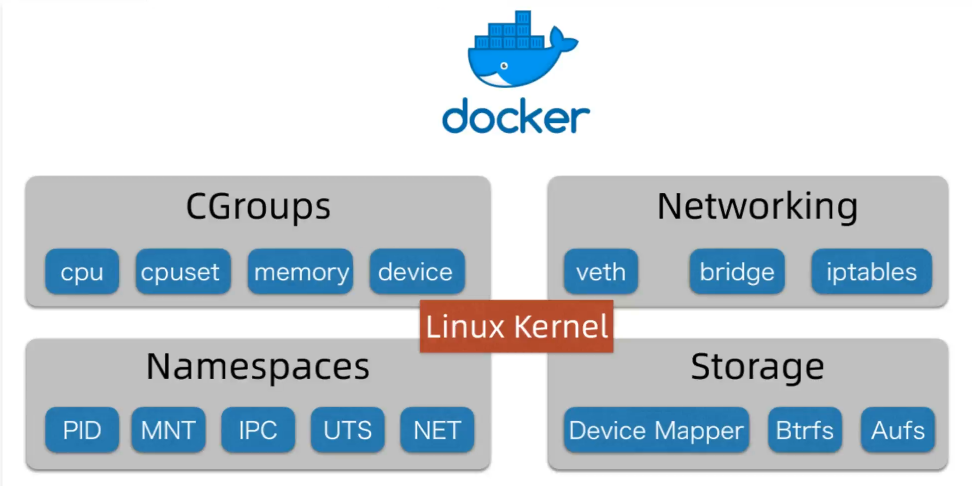

# 代码沙箱接口

## Java原生实现代码沙箱

原生：尽可能不借助第三方库和依赖，用最干净最原始的方式实现
代码沙箱需要: 接收代码 - 编译代码（javac） - 执行代码（java） java -cp . SimpleCompute 1 2

需要注意的是 如果是中文的输出 要关注输出的编码格式，通过chcp可以看到控制台的编码格式，默认是936 GBK编码 UTF-8是195001
但是这种只适用于自己的控制台，如果操作的电脑和环境不一样这种方法就无法通用，所以在javac编译的时候 加上-encoding utf-8参数   javac -encoding utf-8 .\SimpleCompute.java

实际OJ系统，对用户输入代码会有一定要求，便于统一处理，所以把用户输入代码的类名限制为Main，参考清华大学的oj系统

## 核心流程实现
用程序代替人工，用程序操作命令行，去编译执行代码
java进程执行管理类：Process

1.把用户代码保存为文件
2.编译代码，得到class文件
3.执行代码，得到输出结果
4.收集整理输出结果
5.文件清理
6.错误处理，提升程序健壮性

### 1.把用户代码保存为文件
原理就是读取传入的代码转为字符串，写入指定文件中，这里需要注意的是，每次用户提交需要额外创建一个文件夹，因为用户不可能只提交一次代码，这样可以区分不同的提交
可以参考JavaNativeCodeSandbox中的代码

### 2.编译代码，得到class文件
java执行程序：            Process exec = Runtime.getRuntime().exec(compileCmd);
java获取控制台输出          BufferedReader bufferedReader = new BufferedReader(new InputStreamReader(compileProcess.getInputStream()));


### 3.执行程序
第一个占位符：路径 第二个占位符 执行代码需要的输入参数 -Dfile.encoding=UTF-8 设置运行时编码格式为utf-8   
String runCmd = String.format("java -Dfile.encoding=UTF-8 -cp %s Main %s",userCodeParentPath,inputArgs);

可以使用scanner和用户交互方式，让用户不断输入内容并获取输出 方法是ProcessUtils.runInteractProcessAndGetMessage

### 4.整理输出
获取程序执行时间，使用spring的StopWatch获取一段程序的执行时间 这里用最大值执行时间判断程序是否超时


### 5.文件清理
        if(userCodeFile.getParentFile() !=null){
            //这里用的是hutu工具包
            boolean del = FileUtil.del(userCodeParentPath);
            System.out.println("删除"+(del?"成功":"失败"));
        }

### 6.错误处理，提升程序健壮性
创建错误处理方法，然后在catch处return

    private ExecuteCodeResponse getErrorResponse(Throwable e){
        //如果程序报错，返回一个空的response，里面包含错误信息和状态码
        ExecuteCodeResponse executeCodeResponse = new ExecuteCodeResponse();
        executeCodeResponse.setOutPutList(new ArrayList<>());
        //存放程序错误信息
        executeCodeResponse.setMessage(e.getMessage());
        //表示代码沙箱程序错误
        executeCodeResponse.setStatus(2);
        executeCodeResponse.setJudgeInfo(new JudgeInfo());

        return executeCodeResponse;
    }


## 防止恶意代码
从时间上攻击，比如无限睡眠
从空间上攻击，比如无限循环占用内存不释放
读取服务器文件导致文件泄露
向服务器写文件，植入危险程序
运行其他程序，比如木马程序

```java
 package com.yupi.yuojcodesandbox.unsafe;
import java.util.ArrayList;
import java.util.List;
//无限占用空间
public class MemoryError {

    public static void main(String[] args) throws InterruptedException {
        List<byte[]> bytes = new ArrayList<>();

        while(true){
            bytes.add(new byte[10000]);
        }
    }

}
```

实际运行中，会发现，内存占用到达一定空间后程序就会自动报错 oom 这是jvm的一个保护机制
JVisualJvm或Jconsole工具可以连接到jvm虚拟机上来可视化查看运行状态 jconsole在jdk安装bin目录下

```java
//文件泄露 读取服务器文件
public class Main {

    public static void main(String[] args) throws InterruptedException, IOException {
        String userDir = System.getProperty("user.dir");

        String filePath = userDir + File.separator + "src/main/resources/application.yml";
        List<String> allLines = Files.readAllLines(Paths.get(filePath));
        System.out.println(allLines);

    }

}
```

```java
//向服务器写文件，植入危险程序
public class WriteFileError {

    public static void main(String[] args) throws InterruptedException, IOException {
        String userDir = System.getProperty("user.dir");

        String filePath = userDir + File.separator + "src/main/resources/木马程序.bat";
        String errorProgram = "java -version 2>&1";
        Files.write(Paths.get(filePath), Arrays.asList(errorProgram));
        System.out.println("写入程序成功");
    }

}
```

```java
//运行其他程序，比如木马程序
public class RunFileError {

    public static void main(String[] args) throws InterruptedException, IOException {
        String userDir = System.getProperty("user.dir");

        String filePath = userDir + File.separator + "src/main/resources/木马程序.bat";
        Process proces = Runtime.getRuntime().exec(filePath);
        proces.waitFor();
        BufferedReader bufferedReader = new BufferedReader(new InputStreamReader(proces.getInputStream()));

        String compileOutputLine;
        while((compileOutputLine = bufferedReader.readLine()) !=null){
            System.out.println(compileOutputLine);
        }
        System.out.println("执行异常程序成功");
    }
}
```


### 解决方法
1） 超时控制 通过创建一个守护线程，超时后自动中断process

2） 限制给用户分配的资源 不能让每个java进程的执行占用JVM最大堆内存空间都和系统一致，应该小一点比如256MB
在启动java时 可以指定内存大小 -Xmx256m（最大） -xms（最小）
注意！ -Xmx参数，jvm的堆内存限制，不等同于系统实际占用的最大直言，可能会超出，如果需要更严格的内存限制，要在系统层面限制而不是jvm
如果是linux，可以使用cgroup来实现对某个进程的cpu，内存等资源的分配

3） 限制代码 -黑白名单
先定义一个黑白名单，比如哪些操作禁止 HuTool字典树工具类 WordTree，可以用更少的空间存储更多的敏感词汇，以及实现更高效的敏感词查找  **这个可以写在简历上**

**缺点：**  无法遍历所有的黑名单，不同的编程语言，对应的领域，关键词都不一样，限制人工成本很大

4） 限制用户的操作权限（文件，网络，执行）
java安全管理器来实现更严格的限制 security manager   是java提供的保护jvm java安全的机制，可以实现更严格的资源操作限制
限制用户对文件，内存，cpu，网络等资源的操作和访问
继承SecurityManager接口  实际情况下，我们只需要限制子程序的权限即可，不用限制开发者自己写的程序，也就是说限制的代码加在允许用户代码的时候即可
在允许java程序时，指定安全管理器：
java -Dfile.encoding=UTF-8 -cp %s;%s -Djava.security.manager=MySecurityManager Main
**注意：SecurityManager类在jdk17以及被废弃，所以这个方法只适用于17以下的环境！！！！！！**
**缺点：如果要做比较严格的权限限制，要自己判断哪些文件需要控制读写，粒度太细，难以精细化控制**

5） 运行环境隔离
系统层面上，把用户程序封装到沙箱，和宿主机隔离开 使用Docker容器技术实现（底层使用cgroup，namespace等方式实现的）


## Docker容器技术
为了提升系统安全性，把不同的程序和宿主机进行隔离 所以使用docker，使得某个程序的执行不会影响到系统本身
docker技术可以实现程序和宿主机的隔离


### 什么是容器
理解为对一系列应用程序，服务和环境的封装，从而把程序运行再一个隔离的，密闭的，隐私的空间内，对外整体提供服务。 就是一种封装
可以把一个容器理解为一个新的电脑（定制化的操作系统）


### docker基本概念
镜像：用来创建容器的安装包，可以理解为给电脑安装操作系统的系统镜像
容器：通过镜像来创建的一套运行环境，一个容器可以运行多个程序，可以理解为一个服务器
Dockerfile：制作镜像的文件，可以理解为制作镜像的清单，Docker Image：镜像，Docker Container：容器


### Docker实现原理

**Docker运行在linux内核上
CGroups：实现了容器的资源隔离，底层是LinuxCgroup命令，能够控制进程使用的资源
Network网络：实现容器的网络隔离，docker容器内部的网络互不影响
Namespaces命名空间：可以把进程隔离在不同的命名空间下，每个容器都可以有自己的命名空间，不同的命名空间下的进程互不影响
Storage存储空间：容器内的文件是相互隔离的，也可以去使用宿主机的文件
docker compose：是一种同时启动多个容器的集群操作工具，一般情况下开发只要了解即可
镜像仓库：存放镜像的仓库，用户可以从仓库下载现成的镜像，也可以把自己的镜像放到仓库
推荐使用官方镜像hub.docker.com**

一般情况不建议在windows安装docker
windows本身自带了一个虚拟机叫WSL


### Docker常用操作
docker --help
docker 子命令 --help

拉取镜像
docker pull hello-world

根据镜像创建容器
docker create hello-world
启动镜像
docker start ...
查看日志
docker logs ...
删除容器
docker rm ...
删除镜像
docker rmi ...

### java操作Docker
使用docker-java第三方库


DockerClientConfig:用于定义初始化DockerClient的配置，类比于Mysql的链接，线程数配置
DockerHttpClient：用于向Docker守护线程发送请求的客户端，底层封装，不推荐使用
DockerClient：才是真正和Docker守护进程交互，最方便的SDK，高层封装，对DockerHttpClient再进行了一层封装，理解成Mybatis，提供了现成的增删改查


### linux远程开发
可以使用idea直接remote development 也可以再idea配置sftp链接
两者区别就是 第一种直接用linux代码 第二种是在windows开发然后push到linux
天坑：要开放2375的tcp端口给windows使用 否则无法连接
案例在DockerDemo.java
而且第二种在运行代码的时候会出问题


## Docker实现代码沙箱
实现流程:docker负责运行java程序,得到运行结果
**重点:要把编译后的代码上传到容器环境内**

这里可以使用模板方法设计模式:定义同一套实现流程,让不同子类去负责不同流程的具体实现,执行步骤一样,每个步骤实现方式不一样

创建容器,上传编译文件
启动容器执行代码
docker执行容器,操作已启动容器
docker exec


复用javaNativeCodeSandbox的逻辑,逻辑就可以跑通了，至此为止还有一点问题是安全问题
## Docker 容器安全性
awaitCompletion 在这里设置执行时间，如果超时直接退出 达到控制效果
但是这种方式无论与否都会继续往下面执行，所以使用一个变量
然后通过hostConfig的withMemory设置内存最大值

```java
        CreateContainerCmd containerCmd = dockerClient.createContainerCmd(image);
        //创建容器时,绑定终端和容器的目录,第一个参数是本机代码存放目录,第二个参数是放入linux环境要存放的目录 作用是把本地文件同步到容器中,可以让容器访问 也可以叫挂载目录
        HostConfig hostConfig = new HostConfig();
        //设置容器内存 设置为100M
        hostConfig.withMemory(100*1000*1000L);
        //设置容器的cpu 设置为1核
        hostConfig.withCpuCount(1L);

        /*这里这么做的目的是 因为这个目前是在windows开发,然后远程操作linux运行,然后代码会自动push到linux的文件夹,本质还是本地开发,所以使用file.seperator获取分隔符是没有意义的
         * 因为这里是将linux中项目代码存放目录中的用户运行代码tmpCode映射到一个专门存放用户代码的文件夹,如果不改的话会导致第一i给参数映射的文件夹是windows那么把这个文件夹拿到linux去找是找不到会报错的*/
        //这里改为linux代码位置
//        String linuxCodePathName = "/home/zeden/"  + GLOBAL_CODE_DIR_NAME;
//        String linuxUserCodeParentPath = linuxCodePathName + "/" + uid;
        hostConfig.setBinds(new Bind(userCodeParentPath,new Volume("/app")));
        // .withCmd("echo","Hello Docker") 配置创建容器前执行的命令
        // .withAttachStdin(true).withAttachStderr(true).withAttachStderr(true) 把docker和本地的终端获取链接,能获取输入输出
        // .withTty(true) 创建一个交互终端
        CreateContainerResponse createContainerResponse = containerCmd
                .withNetworkDisabled(true) //创建容器时设置网络容器为关闭
                .withHostConfig(hostConfig)
                .withAttachStdin(true)
                .withAttachStderr(true)
                .withAttachStderr(true)
                .withTty(true)
                .exec();
        System.out.println(createContainerResponse);
        String containerId = createContainerResponse.getId();
```

至于权限管理，docker容器已经做了系统层面的隔离，比较安全，但不能保证绝对安全
可以结合java安全管理器和其他策略去使用 比如再创建容器时，限制用户不能向root根目录写文件                 .withReadonlyRootfs(true)
或者使用linux自带的一些安全管理措施 seccomp（security compute mode） linux内核安全机制


7


